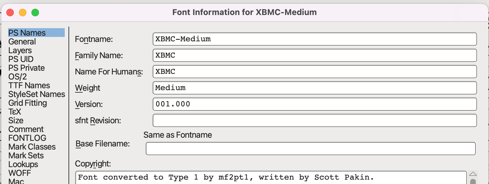

# 手动从METAFONT生成XBMC10.pfb / logo10.pfb

工具：

1. texlive : `brew install texlive`

   1. pdftex : \pdfmapline `<` for pfb and `<<` for otf

   2. mf2pt1

   3. mktexpk 

2. pdffonts : `brew install poppler` `brew list poppler`

3. fontforge : https://github.com/fontforge/fontforge `brew install fontforge`

4. xquartz : https://www.xquartz.org

5. cp : macOS builtin command-line tool

6. sudo : macOS builtin command-line tool

   

## 使用点阵字体

假设，用pdftex编译 `pdftex tex.tex `，会出现如下错误信息：

```shell
This is pdfTeX, Version 3.141592653-2.6-1.40.26 (TeX Live 2024) (preloaded format=pdftex)
 restricted \write18 enabled.
entering extended mode
(./tex.tex (/usr/local/texlive/2024/texmf-dist/tex/plain/cweb-old/pdfwebmac.tex
(/usr/local/texlive/2024/texmf-dist/tex/generic/pdftex/pdfcolor.tex))
kpathsea: Running mktextfm logo
mkdir: ././usr/local/texlive/2024/texmf-var/fonts/tfm/public: Permission denied
mktextfm: mktexdir /usr/local/texlive/2024/texmf-var/fonts/tfm/public/knuth-lib failed.
kpathsea: Appending font creation commands to missfont.log.

! Font \logo=logo not loadable: Metric (TFM) file not found.
<to be read again> 
                   \def 
l.74 \def
         \MF{{\logo META}\-{\logo FONT}}
? ^C^D
! Emergency stop.
<to be read again> 
                   \def 
l.74 \def
         \MF{{\logo META}\-{\logo FONT}}
!  ==> Fatal error occurred, no output PDF file produced!
Transcript written on tex.log.

```
我们稍微分解一下问题：
```
mkdir: ././usr/local/texlive/2024/texmf-var/fonts/tfm/public: Permission denied # 目录无法创建文件
mktextfm: mktexdir /usr/local/texlive/2024/texmf-var/fonts/tfm/public/knuth-lib failed. #mktextfm 无法调用mktexdir
```

再看看missfont.log看看

```
mktexpk --mfmode / --bdpi 600 --mag 1+0/600 --dpi 600 logo10
mktexpk --mfmode / --bdpi 600 --mag 1+0/600 --dpi 600 cmtt10
mktexpk --mfmode / --bdpi 600 --mag 1+0/600 --dpi 600 cmr9
mktexpk --mfmode / --bdpi 600 --mag 1+0/600 --dpi 600 cmtex10
```

其中的logo10、cmtt10、cmr9、cmtex10对应的pfb文件是没有的，可以借助mktexpk生成：

```
sudo mktexpk --mfmode / --bdpi 600 --mag 1+0/600 --dpi 600 logo10
sudo mktexpk --mfmode / --bdpi 600 --mag 1+0/600 --dpi 600 cmtt10
sudo mktexpk --mfmode / --bdpi 600 --mag 1+0/600 --dpi 600 cmr9
sudo mktexpk --mfmode / --bdpi 600 --mag 1+0/600 --dpi 600 cmtex10
```
那么再次编译的时候就不会出现错误了：

```
mktexpk: Running mf-nowin -progname=mf \mode:=ljfour; mag:=1+0/600; nonstopmode; input logo10
This is METAFONT, Version 2.71828182 (TeX Live 2024) (preloaded base=mf)

(/usr/local/texlive/2024/texmf-dist/fonts/source/public/knuth-lib/logo10.mf
(/usr/local/texlive/2024/texmf-dist/fonts/source/public/knuth-lib/logo.mf
[77] [69] [84] [65] [70] [80] [83] [79] [78]) )
Font metrics written on logo10.tfm.
Output written on logo10.600gf (9 characters, 1748 bytes).
Transcript written on logo10.log.
mktexpk: /usr/local/texlive/2024/texmf-var/fonts/pk/ljfour/public/knuth-lib/logo10.600pk: successfully generated.
/usr/local/texlive/2024/texmf-var/fonts/pk/ljfour/public/knuth-lib/logo10.600pk
➜  Tex_Document cp /usr/local/texlive/2024/texmf-var/fonts/pk/ljfour/public/knuth-lib/logo10.600pk .
```

## 生成并使用pfb字体

不过 ，有没有一种方式，直接生成pfb字体，然后调用呢？毕竟点阵字体不够美观，texlive是有这种工具的——mf2pt1[^1]，在命令行执行：

```
mf2pt1 xbmc10.mf

############################
Invoking "mpost -mem=mf2pt1 -progname=mpost '\mode:=localfont; mag:=100; bpppix 0.02;
... 省略
mf2pt1 is using the following font parameters:
    font_version:              001.000
    font_comment:              Font converted to Type 1 by mf2pt1, written by Scott Pakin.
    font_family:               CMBX # 字体信息不对！！！
    font_weight:               Medium
    font_identifier:           CMBX
    font_fixed_pitch:          false
    font_slant:                0
    font_underline_position:   -100
    font_underline_thickness:  50
    font_name:                 CMBX-Medium
    font_size:                 9.9626400996264 (bp)
    font_coding_scheme:        TeX
... 省略
*** Successfully generated xbmc10.pfb! ***
```
依据上面的错误信息，执行`cp $(kpsewhich cmbx10.mf) ` 和 `cp $(kpsewhich xbmc10.mf) .` 把两个文件复制本地，同时修改，cmbx10.mf，把其中一行 `font_identifier:="CMBX"; font_size 10pt#;` 改成` font_identifier:="XBMC"; font_size 10pt#;`  再次执行 `mf2pt1 ./xbmc10.mf`，提示信息就对了：

```
mf2pt1 is using the following font parameters:
    font_version:              001.000
    font_comment:              Font converted to Type 1 by mf2pt1, written by Scott Pakin.
    font_family:               XBMC
    font_weight:               Medium
    font_identifier:           XBMC
    font_fixed_pitch:          false
    font_slant:                0
    font_underline_position:   -100
    font_underline_thickness:  50
    font_name:                 XBMC-Medium
    font_size:                 9.9626400996264 (bp)
    font_coding_scheme:        TeX
```

用fontforge打开生成的XBMC10.pfb：



把生成xbmc10.pfb和xbmc10.afm复制到`/usr/local/texlive/2024/texmf-dist/fonts/type1/public/amsfonts/cm/` 执行 

```
chmod +x /usr/local/texlive/2024/texmf-dist/fonts/type1/public/amsfonts/cm/xbmc10.pfb
chmod +x /usr/local/texlive/2024/texmf-dist/fonts/type1/public/amsfonts/cm/xbmc10.afm
```

用pdftex再次编译pdftex.tex：

```
(see the transcript file for additional information)</usr/local/texlive/2024/texmf-dist/fonts/type1/public/amsfonts/cm/cmbx10.pfb>
...
</usr/local/texlive/2024/texmf-dist/fonts/type1/public/amsfonts/cm/xbmc10.pfb> ### 这里就是我们生成的pfb字体
```

把生成的字体通过pdfmapline加入到pdftex.tex里，重新编译：

```
\pdfmapline{xbmc10  XBMC10 <xbmc10.pfb}
```
就能可以正确显示我们的字体了：

```
pdffonts ./pdftex-pagella.pdf | awk '{print $1}'
name
------------------------------------
MUJLYT+CMSY10
OUYWRU+TeXGyrePagella-Regular
PHZYKM+CMR8
AOMILD+CMBX10
JAUNVC+CMMI10
JZIYIM+CMTEX10
RFUJKT+CMSL10
LFRWWV+CMR9
QGVKNK+CMTI10
CXZXZU+CMTT10
XDLDZS+XBMC-Medium  # 这里就是我们生成的字体
BHPFVW+CMR7
WIFVRI+CMSY7
CCZYIA+CMMI7
IPXVPS+logo10-Medium
SOJQKW+CMEX10
```


同理生成logo10.pfb。

## Reference

[^1]: mf2pt1 `texdoc mf2pt1`

